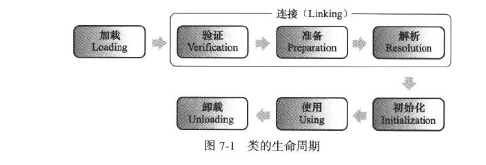

# 类及其加载机制

## Class 类文件结构

> 类或接口不一定定义在文件中，也可以由类加载器生成。

class 文件是一组以8位字节为基础单位的二进制流，各个数据项目严格按照顺序紧凑的排列在 class 文件中，中间没有添加任何分隔符。对于占用8位字节以上的数据，则按照高位在前\(地址低位\)的方式分割成多个字节存储。

根据 Java 虚拟机规范，class 文件格式采用一种类似于 C 语言结构体的伪结构来存储数据，这种结构只包含两种数据：**无符号数和表**。

* 无符号数属于基本的数据类型，以u1、u2、u4、u8来分别表示1、2、4、8个字节的无符号数，可以用来描述数字、符号引用、数量值或者按照UTF-8编码构成字符串值。
* 表是由多个无符号数或者其他表组成的复合数据类型，所有的表都以"\_info"结尾，表用于描述有层次关系的复合结构的数据，整个class文件本质上就是一张表。

无论是无符号数还是表，当需要描述同一类型但是数量不定的多个数据时，经常会使用一个前置的容量计数器加若干连续数据项表示，这时称这些连续的数据为某一类型的集合。

### 魔数\(Magic Number\)

每个 class 文件的前4个字节成为魔数，它的唯一作用就是确定这个文件是否为一个能被虚拟机接收的 class 文件。

class 文件的魔数是为：`0xCAFEBABE`

### class 文件版本

class 文件的第5、6个字节为次版本号\(minor version\)，第7、8个字节为主版本号\(major version\)。Java 的版本号从 45 开始，每发布一个大版本就加1。高版本的 JDK 能向下兼容低版本的class文件，但不能运行更高版本的class，虚拟机必须拒绝执行高于其版本号的class文件。

## 类加载过程

#### 加载

1. 通过类的全限定名来获取定义此类的二进制字节流
2. 将这个字节流代表的静态存储结构转化方法区的运行时数据结构
3. 在内存中生成一个代表这个类的 java.lang.Class 对象，作为方法区这个类的各种数据的访问入口

#### 验证

连接的第一步，目的是确保Class文件字节流中包含的信息符合当前虚拟机要求，并且不会危害 虚拟机自身的安全。

* 文件格式验正
* 元数据验正
* 字节码验证
* 符号引用 验证

#### 准备

正式为类变量分配内存并设置变量初始值的阶段，这些变量使用的初始值都将在方法区分配。进行内存分配的是类变量而不是实例变量，会赋值为初始值。只有被final修饰的常量才会被赋成设定的值。

#### 解析

将常量池中的符号引用替换为直接引用过程。

* 类或接口解析
* 字段解析
* 类方法解析
* 接口方法解析

#### 初始化 

真正开始执行类中定义的 Java 程序代码，根据程序员制定的主观计划去初始化类变量和其他资源。

## 类加载器的Parents Delegation 模型（TODO）

双亲委派模型除了顶层的启动类加载器外，所有的类加载器都有自己的父类加载器。

工作过程：类加载器收到类加载请求后，首先会委派给父类加载器进行加载，每一层都是如此，最终类加载请求会传给顶层的启动类加载器。只有当父类加载器无法完成加载请求时，子类加载器才会尝试自己去加载。

使用双亲委派模型组织类加载器，**使得类同加载器一起具备带有优先级的层次关系。例如java.lang.Object 只会委派给启动类加载器进行加载，防止出现多份同样的字节码以及核心类被篡改。**

