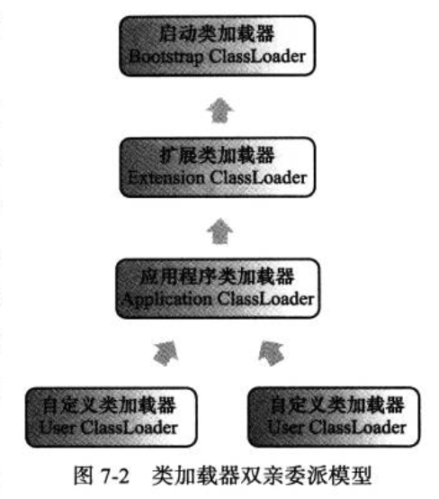

# 类加载机制

虚拟机把描述类的数据从Class文件加载到内存，并对数据进行校验、解析和初始化，最终形成可以被虚拟机使用的 Java 类型，这就是虚拟机的类加载机制。

## 类的「生命周期」

## 类加载的时机

## 类加载过程

#### 加载

1. 通过类的全限定名来获取定义此类的二进制字节流
2. 将这个字节流代表的静态存储结构转化方法区的运行时数据结构
3. 在内存中生成一个代表这个类的 java.lang.Class 对象，作为方法区这个类的各种数据的访问入口

#### 验证

连接的第一步，目的是确保Class文件字节流中包含的信息符合当前虚拟机要求，并且不会危害 虚拟机自身的安全。

* 文件格式验正
* 元数据验正
* 字节码验证
* 符号引用 验证

#### 准备

正式为类变量分配内存并设置变量初始值的阶段，这些变量使用的初始值都将在方法区分配。进行内存分配的是类变量而不是实例变量，会赋值为初始值。只有被final修饰的常量才会被赋成设定的值。

#### 解析

将常量池中的符号引用替换为直接引用过程。

* 类或接口解析
* 字段解析
* 类方法解析
* 接口方法解析

#### 初始化 

真正开始执行类中定义的 Java 程序代码，根据程序员制定的主观计划去初始化类变量和其他资源。

## 类加载器的Parents Delegation 模型（TODO）

双亲委派模型除了顶层的启动类加载器外，所有的类加载器都有自己的父类加载器。

工作过程：类加载器收到类加载请求后，首先会委派给父类加载器进行加载，每一层都是如此，最终类加载请求会传给顶层的启动类加载器。只有当父类加载器无法完成加载请求时，子类加载器才会尝试自己去加载。

使用双亲委派模型组织类加载器，**使得类同加载器一起具备带有优先级的层次关系。例如java.lang.Object 只会委派给启动类加载器进行加载，防止出现多份同样的字节码以及核心类被篡改。**

