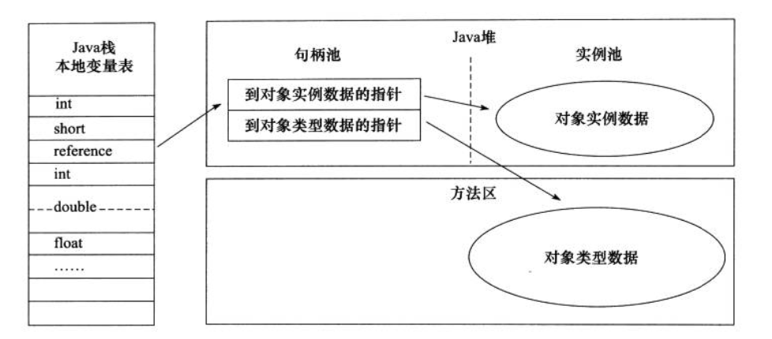

# HotSpot 对象

## 对象的创建

1. new 指令
2. 2. 检查指令参数能否在常量池中定位到一个类的符号引用
3. 检查符号引用对应的类是否已经加载、解析和初始化过（如果没有需先进行类加载过程）
4. 虚拟机为新生对象分配内存（内存大小在类加载完成后便可以确定）
5. 将内存空间初始化为零值
6. 对对象进行必要配置\(属于哪个类的实例、对象的哈希码、对象的GC分代年龄，这些信息存放在对象头\(Object Header\)中\)
7. 执行对象的构造方法&lt;init&gt;

### 为对象分配空间的方法

为对象分配空间的任务等同于把一块大小确定的内存从 Java 堆中划分出来。

假设 Java 堆中的内存时绝对规整的，用过的内存放在一边，未用过的内存 放在另一边，中间存放着一个指针作为分界点的指示器，则分配内存就是把指针往空闲的一侧移动与对象大小相等的距离，这种分配方式成为「**指针碰撞**」\(Bump the pointer\)。

如果 Java 堆中内存不是规整的，已使用的内存和未使用的内存相互交错，那就没有办法应用指针碰撞了，虚拟机必须维护一个列表，记录哪些内存块是可用的，当分配空间时，找一块足够大的空间分配给内存实例，并更新列表上的记录，这种分配方式成为「**空闲链表**」\(Free List\)。

选择哪种分配方式由Java堆是否规整决定，而 Java 堆是否规整又由所采用的垃圾收集器是否带有压缩整理功能决定。

### 如何保证内存分配的线程安全

对象创建在虚拟机中是非常频繁的行为，即使是修改一个指针所指向的位置，在并发情况下也不是线程安全的，可能出现正在给对象 A 分配内存，指针还没来得及移动，对象 B 又使用原来的指针分配内存的情况。

解决方案：

* 对分配内存空间的动作进行同步处理——虚拟机采用CAS和失败重试保证更新操作的原子性
* 把内存分配的动作按照线程划分在不同的空间中进行，每个线程预先在堆中分配一小块内存，成为本地线程分配缓冲（Thread Local Allocation Buffer，TLAB），线程的内存分配在自己的 TLAB 上进行，只有TLAB用完并分配新的 TLAB 时，才需要同步锁定。虚拟机是否使用TLAB，可以通过 -XX:+/-UseTLAB 来配置

## 对象的内存布局

在 HotSpot 虚拟机中，对象在内存中存储的区域分为三部分：对象头\(Header\)、实例数据\(Instance Data\)和对齐填充\(Padding\)。

### 对象头

对象头分为两部分，第一部分用于存储自身的运行时数据：如哈希吗、GC分代年龄、锁状态标志、线程持有的锁等，这部分数据在 32 位 和 64 位的虚拟机中分别为 32 bit 和 64 bit，官方成为"Mark Word"。考虑到空间效率，Mark Word 被设计成一个非固定的数据结构，以便在极小的空间内存储尽量多的信息，它会根据对象的状态复用自己的存储空间。

对象头的另外一部分是类型指针，即对象指向它的类元数据的指针，虚拟机通过这个指针确定这个对象是哪个类的实例。

> 并不是所有的虚拟机实现都需要在对象数据上保留类型指针，也就是说，查找对象的元数据信息并不一定要经过对象本身。
>
> 另外，如果对象类型是 Java 数组，那对象头中还要有一块记录数组长度的信息。因为虚拟机可以通过普通对象的元信息知道对象的大小，但是从数据的元数据信息中无法获得数组的大小。

### 实例数据

实例数据部分是对象存储的有效信息，即代码中定义的各种类型的字段内容，包括从父类继承的字段。这部分的存储顺序会受到虚拟机分配策略参数（FieldsAllocationStyle）和字段在 Java 源码中定义的顺序的影响。

HotSpot 默认的分配策略为 longs/doubles 、ints、shorts/chars、bytes/boolean、oops\(Ordinary Object Pointers\)，也就是把相同宽度的字段分配到一起。在满足这个条件的前提下，在父类中定义的字段会出现在子类之前。如果 CompactFields 设置为 true\(默认为true\)，那么子类中较窄的变量会插入到父类变量的间隙中。

### 对齐填充

对齐填充不是必然存在的，仅仅起着占位符的作用。由于 HotSpot VM 的自动内存管理系统要求对象的起始地址必须是8字节的整数倍，也就是说对象的大小必须是8字节的整数倍。而对象的头部数据刚好是8字节的整数倍，所以当实例数据部分没有对齐时，需要进行填充。

> 对齐的好处是方便 CPU 对内存数据的读取。

## 对象的访问定位

Java 程序需要通过栈上的引用\(reference\)数据来操作堆上的具体对象，虚拟机规范中并没有规定引用该以何种方式定位、访问堆中的对象。目前主流的访问方式有使用句柄和直接指针两种。

### 句柄访问

Java 堆中划分出一块区域作为句柄池，而引用中存储的是对象的句柄的地址，句柄中包含了类的实例数据和类型数据的地址信息。

好处是 reference 中存储的是对象的句柄地址，在对象被移动（垃圾回收）时，不用更新reference的数据，只需要修改句柄中的地址。

缺点多了一次指针定位的时间开销。

### 直接指针

引用中存储的是对象在堆中的地址，对象布局中需要放置访问类型数据的相关信息。

好处：相比使用句柄速度快。

缺点：对象移动时要同时更新引用的值。

**HotSpot VM 使用直接指针的方式访问对象。**

